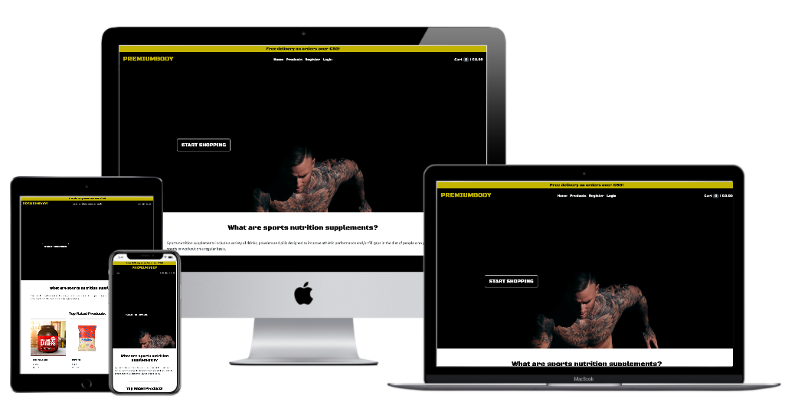

<h1 align="center">PREMIUMBODY</h1>

<h2 align="center"> MS4 - Full Stack Frameworks - Code Institute </h2>

[Click here for a live demo version of this project.](https://premiumbody.herokuapp.com/)

This project is a sports nutrition supplements e-commerce web application. The main goal is to allow users to register a profile and purchase the products avaiable.
The business/store owner can access, archive, edit or add products to the database through the Admin interface. 

## User Experience (UX)

### User Stories

note: in order to make a purchase, users have to be registered and logged in.

"As a user, I would like to, ___________"
 (all the following items have been succefully implemented)

- view the website from any device (mobile, desktop, tablet)
- be able to see a list of all products as a non registered user as well as detailed information about each one.
- filter the products by category.
- sort the products by price and rating (ascending and descending order).
- be able create my own profile.
- be able to login and logout.
- be able to search for products by name or keyword.
- be able to see the top rated products.
- be able to see other users comments about their experience with the website on the home page.
- be able to leave a comment once a purchase has been completed.
- be able to add and remove products to and from the cart, as well as update the quantity of each item.
- be able to make a purchase of the items in the cart with a credit card. 
- have access to detailed information about my purchase once it is completed, as well as get that same information on my email through a confirmation email. 
- have a profile page where i can see and update my delivery information, as well as be able to see a list of all my previous orders and potencial promotional codes to be used in future purchases.
- be able to see the cart total amount and the number of items in it at all times. 
- be able to use my promotional codes when making a payment.

### Design

-   #### Colour Scheme
    -   The colours used in this project are black and yellow(#C0B01F). After a lot of research I have come to realize that the combination of yellow and black is often used in sports nutrition supplements web applications. 

-   #### Typography
    -   The font-family "Black Ops One" is the one used for the logo, navigation bar, page titles and buttons. This font has a very powerful look and since the web application is gym/health related it felt like the right one to use. For the website content the font-family used is "Assistant", smooth, clean and easy to read. Sans Serif is the fallback font used in case 'Black Ops One' and/or "Assistant" are not being imported into the project correctly.

-   #### Imagery
    -   All the images are sports nutrition supplements related. If there is no image file/url  associated to the product a default image will be displayed instead.

-   ### Wireframes
    -   [View Mockups]() 

## Features

### Exisiting Features

#### Register an account
- Anybody can register for free and create their own unique account. A register button can be found on the navigation bar.

#### Log In/ Log Out to/from Account
- Registered users can safely Log In and Log Out by using the login/logout buttons on the navigation bar.

#### View, search and sort products 
- The products can be accessed from the navigation bar and the "Start Shopping" button on the home page. Each page displays 8 products and the user can use the pagination at the bottom to see to following 8 products, and so forth. The users can see the products detailed information by clicking on the product image they wish to know more about.
There is a search box at the top of page that allows the users to search for a particular product by name and by keyword.
In order to filter products by category, there is a select box to the left of the screen. To sort by price or rating, there is a select box to the right of the screen.

#### Add/remove products to/from cart and update quantity
- Once users are Logged In they can add products using the button with the cart icon available on each product card. Users can also add products to the cart in the detailed product page. From the detailed product page, the users can also decide the quantity of that particular product to be added to the cart. To remove a product or updated its quantity, the users have to click on the cart information (right of the navigation bar) and once they are redirected to the cart page an action button to remove and an input to update the quantity will be available.

#### Payment, save information and confirmation email 
- Only registered users can purchase products. Once in the cart page and ready to proceed to the payment, the users can press the "checkout" button and they'll be redirected to the payment page, fill out any missing required fields (users can select the option to save information) and complete the order. A field for the promotional code will be available and if filled out and valid the user will be able to see it deducted in the total amount to pay.  Once the order is completed, users are redirected to a success page where the order information will be available. A confirmation email with the order information is automatically sent to the users once order is completed.

#### Promotional Codes
- For every purchase over 100€, a promotial code will be generated and the users will be able to use it in the following purchase. The discount will be of 10€. A list of promotional codes can be found on the profile page. The users will also have access to informatin about if and which codes have or not been used.

#### Profiles 
- In the profile page, the user will be able to update the delivery information, as well as have access to the promotional codes and order history.

#### Review
- Users can leave a review once the finalize their purchase. A comment box will be available in the order confirmation page. 

### Features Left to Implement

- I would to like to add toasts to this project is order to show messages everytime the user performes an action. Messages can be thoughout the different code files in the project waiting to be displayed once toasts are implemented.

## Technologies Used

### Languages Used

-   [HTML5](https://en.wikipedia.org/wiki/HTML5)
-   [CSS3](https://en.wikipedia.org/wiki/Cascading_Style_Sheets)
-   [Python](https://en.wikipedia.org/wiki/Python_(programming_language))
-   [JavaScript](https://en.wikipedia.org/wiki/JavaScript)

### Frameworks, Libraries & Programs Used

1. [Google Fonts:](https://fonts.google.com/)
    - "Black Ops One" and "Assistant" are the fonts used in this project, imported from Google Fonts.
1. [Git](https://git-scm.com/)
    - Git was used for version control by utilizing the Gitpod terminal to commit to Git and Push to GitHub.
1. [GitHub:](https://github.com/)
    - GitHub is used to store the project's code after being pushed from Git.
1. [Figma:](https://figma.com/)
    - Figma was used to create the wireframes for this project.
1. [Django:](https://www.djangoproject.com/)
    - Django was the framework used to build this project.
1. [jQuery:](https://jquery.com/)
    - jQuery was used to make certain Bootstrap components to function.
1. [Bootstrap:](https://getbootstrap.com/docs/4.4/getting-started/introduction/)
    - Bootstrap was used to assist with the responsiveness and styling of the website.
1. [PostgreSQL:](https://www.postgresql.org/)
    - PostgreSQL was the database service used to store the project's data.
1. [Stripe:](https://stripe.com/)
    - Stripe was the online payment processing platform used in this project to process the card payments.
1. [Amazon Web Services(AWS):](https://aws.amazon.com/)
    - Amazon Web Services (S3) was used to store the projects static and media files.

## Testing

### Creating an account

I've created my own personal account, along with the superuser account (/admin). Confirm authentication  worked as expected.

### Creating an account

Several attempts to Log In and Log Out were performed. Worked as expected.

### Add | Remove a product from cart ###

Plenty of testing was done to ensure that each product can be added and remove from the cart. Works as expected. 

### Pagination ###

#### Pagination without Search ####
- *Previous Page* button disabled on products first page.
- *Next Page* button disabled on products last page.
- Appropriate number of pages appear based on the number of items per page(8).
- Each page number returns their correct page URL.

#### Pagination with Search ####
- Search results match search parameters.
- *Previous Page* button disabled on first page of search results.
- *Next Page* button disabled on last page of search results.
- Each page number returns their correct page URL.

### Sort by Price or Rating and Filter by Category ###

#### Sorting ####
- Sorting by "Price" works accordingly:
    - ascending (Low to High)
    - descending (High to Low)
- Sorting by "Rating" works accordingly:
    - ascending (lowest to highest)
    - descending (highest to lowest)

#### Filter ####
- Filter by Category works accordingly:
    - When selecting a particular category, only the products that belong to that category are displayed.

#### Payment ####

Several payments were performed and it always worked as expected.

note: more testing should have been described here but due to the project deadline that was not possible.

## Credits

### Media

-   The hero image is from the free stock image library [Unsplash](https://unsplash.com/).
-   The Portuguese sports nutrition supplement company [Gold Nutrition](https://goldnutrition.pt/) kindly authorized me to use their products (images and product details) for this project.

### Acknowledgements

-   My Mentor for continuous helpful feedback.
-   A major part of the logic and web application structure used in the PREMIUMBODY project is from a Code Institute tutorial that can be found in this [GitHub repository](https://github.com/ckz8780/boutique_ado_v1). 
